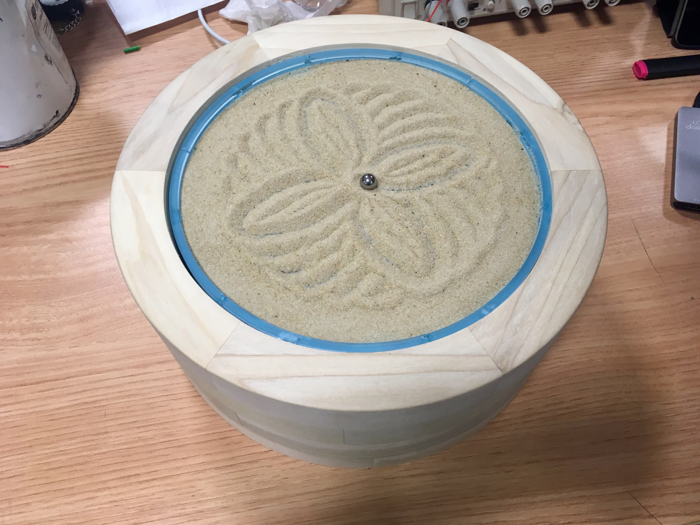

# Sandala

Sandala is device that sketches patterns similar to those generated by a spirograph in sand. It does this by rolling a ball bearing through the sand, controlling it with a magnet from underneath.

### How does it work?

There are two stepper motors. One drives the horizontal motion of a magnet through a rack-and-pinion. The other drives the rotational movement of the plate the sand is sat upon.

### How can I build my own Sandala?

Laser cut the files (in final_to_cut.dwg) into 3mm acrylic, then glue together, ensuring all joins are at 90 degrees while they're glued. Along with the laser cut parts, you will need the following items:

- 2 NEMA 17 Stepper Motors
- 1 Sanguinololu board, or Arduino compatible board with 2 stepper drivers
- 1 Potentiometer
- 1 micro switch to act as end-stop
- 1 neodynium magnet, 3mm x 10mm
- 1 ball bearing
- Sand
- Superglue for assembly

On the linear axis, you should take the piece that moves (with the rack) and sand down the edges of each side so they're slightly chamfered. This helps this slider move more freely through the 4 supports.

### How can I make a case like the wooden one in the photo above?

You will need to have access to a lathe, and the process is relatively complex taking several days of workshop time. First, I formed 60 degree segments which were glued together in 6es to form rings. These rings were then stacked (4 high in my case), and glued together. They were then turned on a lathe to form both the inside and the outside to the correct dimensions. Sand thoroughly, then remove from the lathe and insert the acrylic structure inside.

